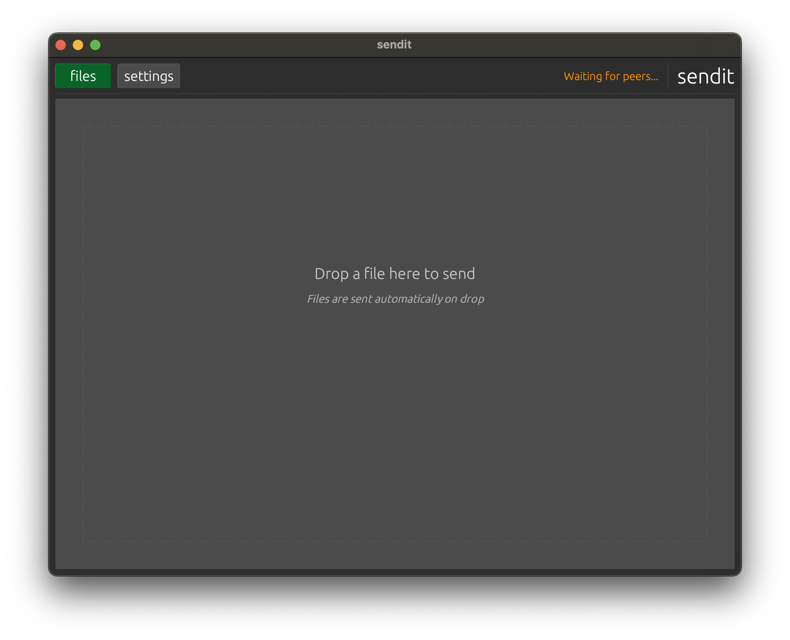

# sendit!
A simple, high-performance, drag-and-drop file transfer tool for local networks. 
## Narrative of Virtues

Open the app, automatically discover peers, drop a file onto the app window and publish instantly to sendit peers. No server, no configuration, just simple and efficient file transfer over modern standards-based peer-to-peer plumbing.

### Virtues

- **Straightforward**: Launch & automatically discover other sendits, no installation, setup or configuration required
- **Drag-and-drop**: Drop a file -> transfer to others
- **Large file support**: Send large files 5GB+
- **High Performance**: Built with Zenoh & Rust for fast app processing and on-wire transfer
- **Networking Options**: Configurable direct connections and multiple data transport types - UDP, TCP, WS, TLS
- **Dark/light mode**: Light mode is almost as delightful as Dark

## To Start Quickly

### Presumptions
- Rust 1.70+

### Build & Run

```bash
git clone <repository-url>
cd send_it
cargo run --release
```

The app auto-connects in peer mode on port 7447 with multicast discovery. Drop a file to send it.

## Useit

### Sending Files
1. Launch sendit
2. Wait for connection (green dot in toolbar)
3. Drag a file onto the central drop zone
4. File is published automatically — topic key is derived from the file's parent directory and filename (e.g. `Documents/photo.jpg`)

### Receiving Files
1. Files from other peers appear in the topic tree (left panel)
2. Click a topic to see details in the slide-out right panel
3. Click "Export Payload" to save the file locally
4. For chunked files, progress shows completion status before export

### Settings
Click the gear icon (top of left panel) to access:
- **Connection**: Transport, address, port, peer/client mode, connect/disconnect
- **Subscriptions**: Subscribe to key expressions, manage active subscriptions
- **Query**: Send queries to the network, configure timeouts
- **Queryable**: Enable a service that responds to queries with locally stored data
- **Memory & Performance**: Memory limits, message limits, rate limiting, deduplication

### Connection Modes
- **Peer mode** (default): Multicast discovery, mesh networking. Leave address blank for auto-discovery, or specify `tcp/ip:port` for specific peers.
- **Client mode**: Connect to a Zenoh router at a specific endpoint.

## License

Apache-2.0
